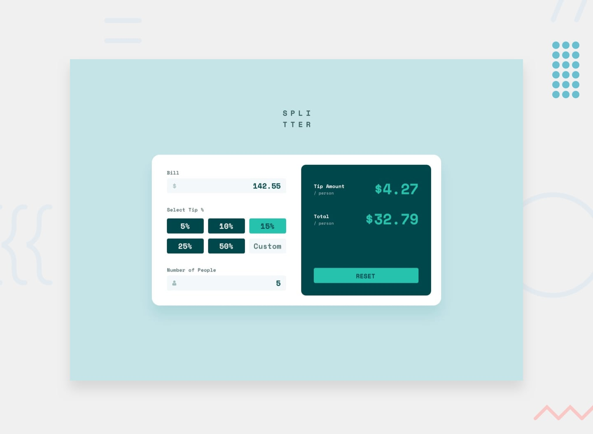

# Tip Calculator App



## Overview

This project is a **tip calculator app** designed to help users quickly split bills and calculate tips accurately. Built with **TypeScript**, it ensures precise real-time calculations and a smooth user experience.

### Key Features

- **Real-time tip calculation** based on bill amount, tip percentage, and number of people  
- **Responsive design** for an optimal experience on all devices  
- **Interactive UI** with hover and focus states for better usability  

## How It Works

1. **Enter Bill Details**  
   - Input the total bill amount  
   - Choose a tip percentage or enter a custom tip  

2. **Define Number of People**  
   - Specify how many people will share the bill  

3. **Get Instant Calculations**  
   - The app calculates **tip per person** and **total per person** dynamically  

4. **Reset Functionality**  
   - Easily reset all values to start a new calculation  

## Live Demo

- [Try the Tip Calculator App](https://juliengdev-tip-calculator-app.netlify.app/)  
- [GitHub Repository](https://github.com/juliengDev/tip-calculator-app)  

## Built With

- **TypeScript** for better type safety and maintainability  
- **Semantic HTML5** for structured and accessible content  
- **SCSS (BEM methodology)** for organized styling  
- **Modern JavaScript (ES6+)** for efficient DOM manipulation  

## What I Learned

This project reinforced my understanding of **state management in interactive applications**, even in a **vanilla JavaScript** environment. Key takeaways:

- **Using TypeScript interfaces** to clearly model data structures  
- **Separation of concerns** with well-defined functions for calculations, UI updates, and event handling  
- **Form validation & error handling** to ensure accurate user inputs  
- **Optimized DOM manipulation** using `querySelector` and `getElementById`  
- **Practical use of ES6+ features** for a cleaner and more readable codebase  

### Code Example: Tip Calculation Logic
```typescript
const calculateTip = (bill: number, tipPercentage: number, people: number): { tipPerPerson: number, totalPerPerson: number } => {
  if (bill <= 0 || people <= 0) return { tipPerPerson: 0, totalPerPerson: 0 };

  const tipAmount = (bill * tipPercentage) / 100;
  const totalAmount = bill + tipAmount;

  return {
    tipPerPerson: parseFloat((tipAmount / people).toFixed(2)),
    totalPerPerson: parseFloat((totalAmount / people).toFixed(2)),
  };
};
```

## Continued Development

Planned future enhancements:
- Dark mode support for improved accessibility
- Persisting user input between sessions using local storage
- Keyboard shortcuts for faster calculations

## Installation

To run this project locally, follow these steps:

1. **Clone the repository**
```bash
git clone https://github.com/juliengDev/tip-calculator-app.git
cd tip-calculator-app
```

2. **Install dependencies**
```bash
npm install
```

3. **Start the development server**
```bash
npm run dev
```

4. **Build for production**
```bash
npm run build
```

5. **Preview the production build**
```bash
npm run preview
```

## Useful Resources

- [MDN: JavaScript Number Methods](https://developer.mozilla.org/en-US/docs/Web/JavaScript/Reference/Global_Objects/Number) - Helped ensure accurate decimal handling
- [CSS-Tricks: Responsive Layouts](https://css-tricks.com/snippets/css/a-guide-to-flexbox/) - Useful for optimizing layout responsiveness
- [W3C Web Accessibility Initiative (WAI)](https://www.w3.org/WAI/) - Ensuring accessible and user-friendly interactions

## Author

- **Portfolio** - [Julien Gilbert](https://juliengilbert.com/)
- **GitHub** - [@juliengDev](https://github.com/juliengDev)
- **LinkedIn** - [Julien Gilbert](https://www.linkedin.com/in/julien-gilbert-reactjs/)

*Never struggle with splitting a bill again! Try the app and calculate tips effortlessly.* 🚀
